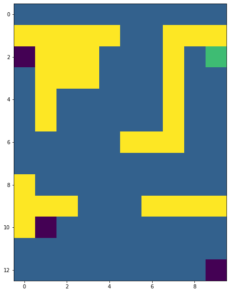
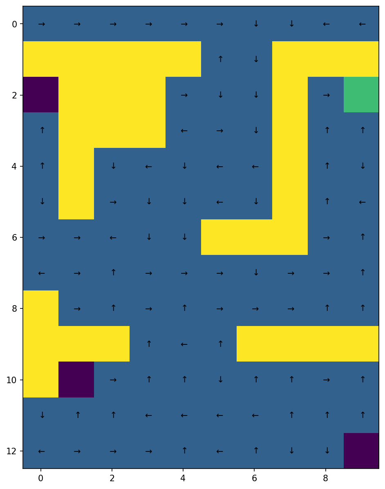
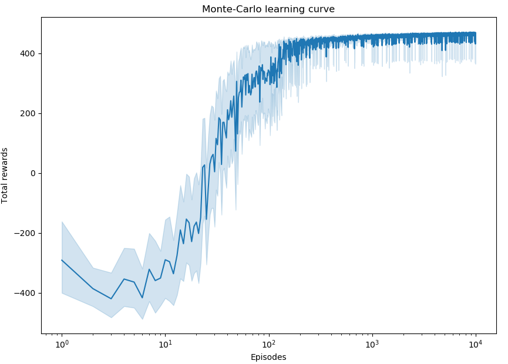

# Introduction to Reinforcement Learning

This is an introduction to reinforcement learning based on the Imperial College course and the corresponding resources. The code inhere covers the theory and implementation of both Tabular Methods and Deep Reinforcement Learning.

## Table of Contents
* [Tabular methods](#tabular-methods)
    * [Dynamic Programming](#dynamic-programming)
    * [Monte-Carlo Methods](#monte-carlo-methods)
    * [Temporal-Difference learning](#temporal-difference-learning)
* [Deep Reinforcement Learning](#deep-reinforcement-learning)

## Tabular methods

Inspired by Sutton and Barton's example in the 4th chapter of its book we will solve a maze to learn how to implement tabular methods. We will implement methods such as Dynamic programming, and others that do not require full knowledge of the dynamic of the environment, namely Monte-Carlo Methods and Temporal-Difference learning. We aim to solve a maze where an agent starts from the top-row cells and its goal is to reach the green cell by maximizing the reward function, considering that when the absorbing states (i.e., the purple ones) are reached the agent gets a reward of -50, -1 when reaching a blue cell and 500 when reaching the goal cell.

### Dynamic Programming 
In order to apply dynamic programming in this problem we could consider using either value iteration or policy iteration. Value iteration will converge in the limit just like the policy iteration algorithm. However, value iteration avoids sweeping through the state set multiple times, and consequently converges faster. Thus, we think that it is going to be the best option in this case.

Bear in mind that value iteration is a specific version of policy iteration that converges faster, where the policy evaluation step has been truncated to just one sweep and we update the value function with the Bellman optimally equation.

Optimal Policy    | Optimal Value function
:---------------------------------:|:-------------------------:
 | 

See the notebook for further details on the influence of $\gamma$ and $p$ on the optimal value function and policy.
### Monte-Carlo Methods

To solve a control problem with a Monte-Carlo agent we could have used an off-policy MC control algorithm, but as Sutton and Barto claim, the value function and the policy is learned from the last steps of the episodes and off-policy MC could slow the learning process. Hence, we are going to use a Monte-Carlo on-policy first visit algorithm.

Optimal policy after 1000 episodes  | Corresponding optimal value function.
:---------------------------------:|:-------------------------:
 | 

For more details on the variability of the learning process and the impact of the variation of $\epsilon$ and $\alpha$ on the learning curves, see the jupyter notebook.

### Temporal-Difference learning
When it comes to Temporal Difference control, we can apply on-policy methods as SARSA or off-policy methods as Q-learning. Q-learning updates the Q values according to a greedy policy and explores new actions according to a behaviour policy which is an $\epsilon$-greedy policy just like in SARSA control methods, allowing finding a more optimal policy while exploring the same number of actions. In our problem, with the same parameters ($\alpha = 0.5$ and $\epsilon = 0.3$) SARSA presents a mean MSE of $37391.84$ and Q-learning an MSE of $22645.75$ after 20 replications, and they converge for the same number of episodes approximately ($\sim$ 80 episodes). Consequently, we have chosen Q-Learning as our Temporal Difference Control algorithm. 

Optimal policy after 1000 episodes  | Corresponding optimal value function.
:---------------------------------:|:-------------------------:
 | 

## Deep Reinforcement learning

